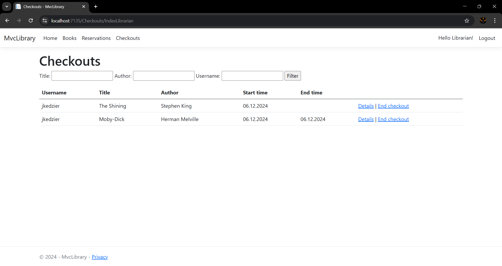
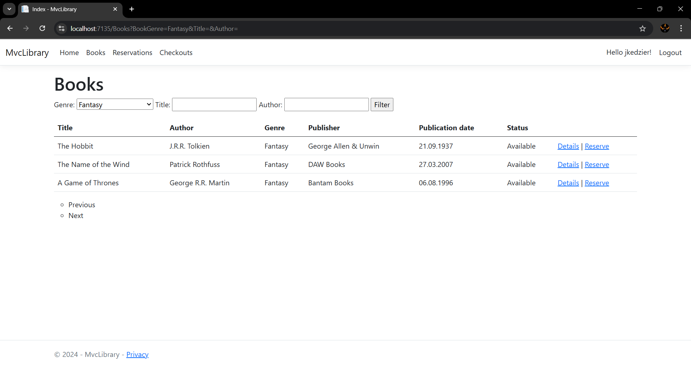
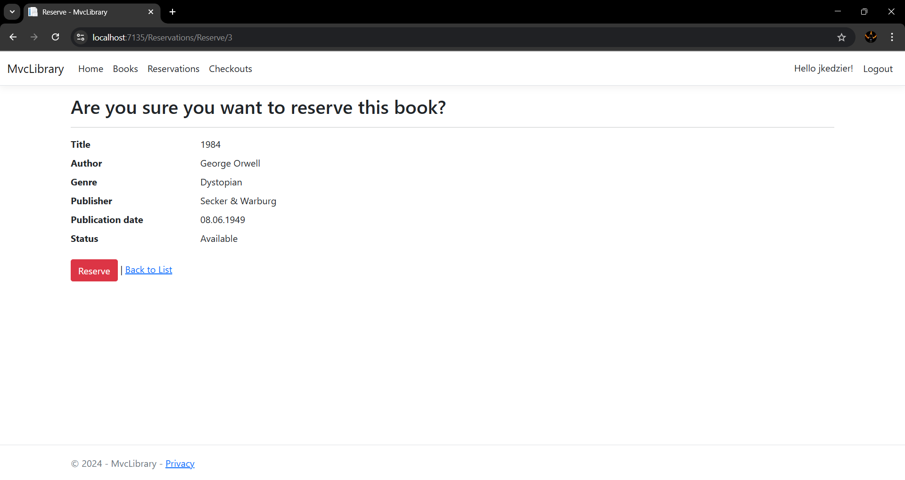
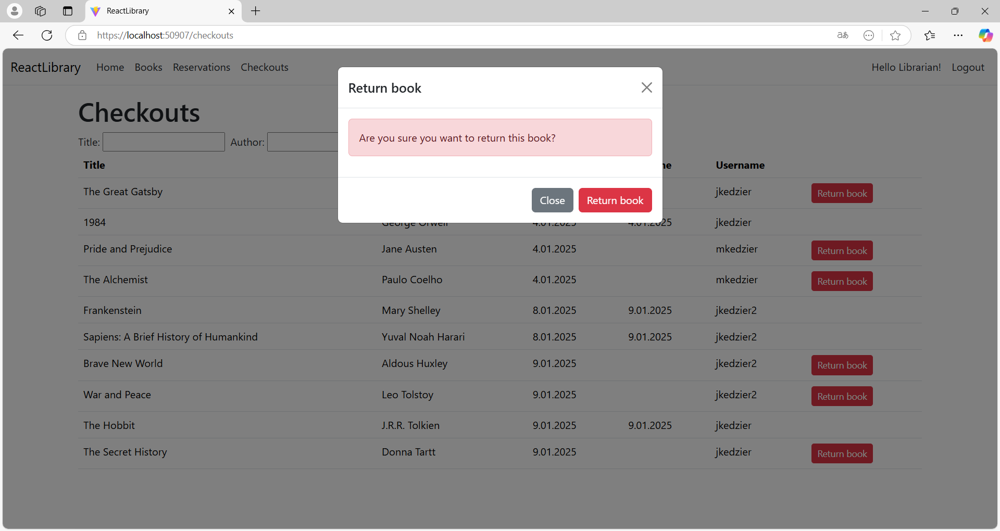
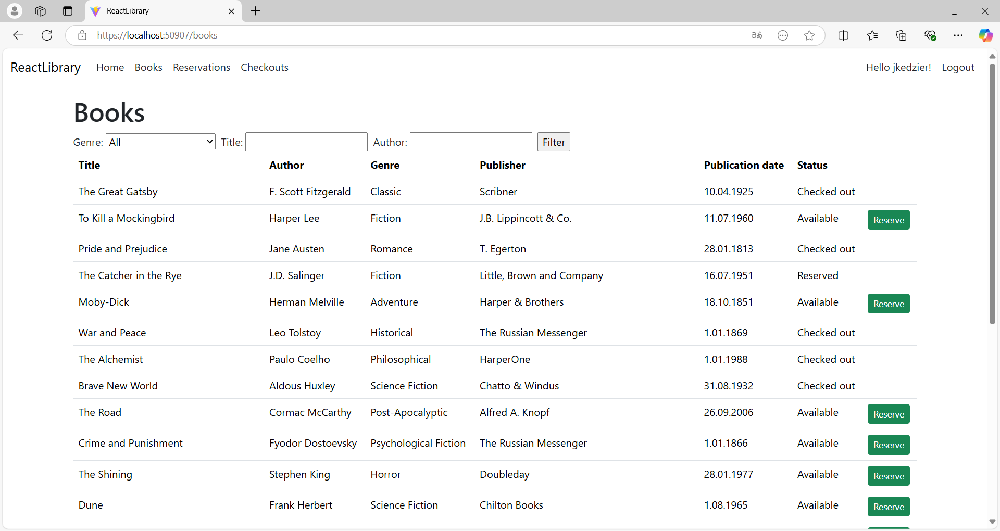
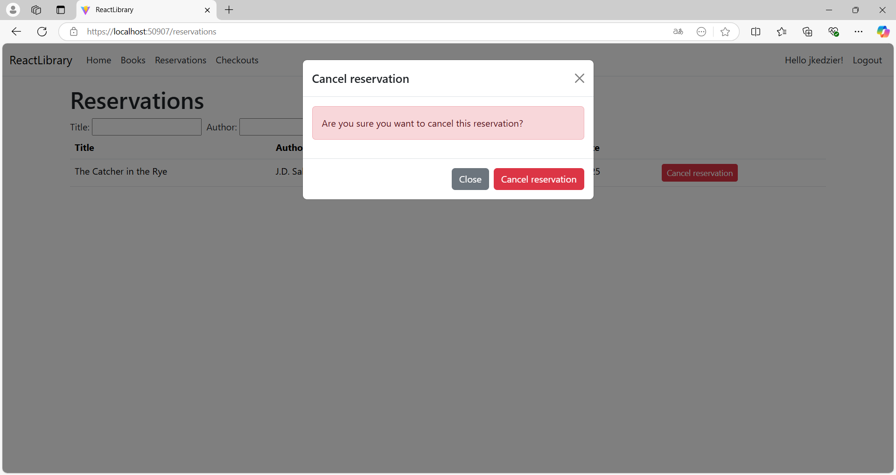

# library
## Description
Simple library handling system written in two configurations:
- `ASP.NET MVC`
- `React TS` + `ASP.NET Web API`

Both configurations use `Bootstrap`, `Entity Framework` and `ASP.NET Core Identity`, implement optimistic concurrency and are configured to use `SQL Server Express LocalDB` as a database.

The second configuration implements authentication using `JWT tokens`.

It was written in the fifth semester (2024Z) as a project for the course *RAD tools (NTR)* at the Warsaw University of Technology.

### `ASP.NET MVC`

#### Librarian

#### User

### `React TS` + `ASP.NET Web API`

#### Librarian

#### User

## Potential improvements
- [ ] - fixing the link between users and their book reservations and checkouts (*UserId* instead of *UserName* as Foreign Key) differentiating different users with the same *UserName* (situation only possible when first user deletes his account)
- [ ] - implementing pagination of displayed data
- [ ] - ensuring proper UI handling of concurrency errors in the second configuration